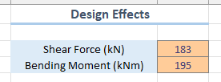

## Usage Instructions
- The input fields (i.e data required for design) are **highlighted in `peach color`**.

  

- Please refrain from changing any fields other than cells highlighted for input (peach color).
- You may change the formulae in other cells if you want see how different design parameters effect other design values and output.
- Some values required for design as per IS 456 and other relevant codes are pre-filled. But just check if there are any new amendments or updated design guidelines and codal provisions.
- Use this as a learning tool - have fun and enjoy the process.
- `Output will always come, it's the right process that gives better output`.

 
 

## Disclaimer
- This repository and the files in it are intended for purely educational purposes only and aim to make the civil engineering design accessible and easier for undergraduate students.
- These spreadsheets cannot be used for commercial purposes or practical construction and cannot replace a fully systematic design software or process required by code-compliant engineering practice.
- By using these files, you acknowledge that the author bears no responsibility for any misuse, misinterpretation, or errors in the results.
- Always consult a licensed structural engineer for actual design work.